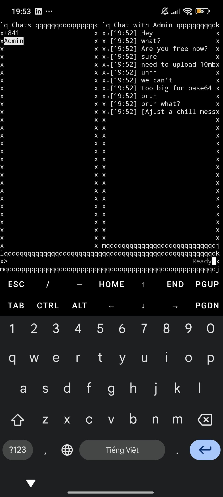
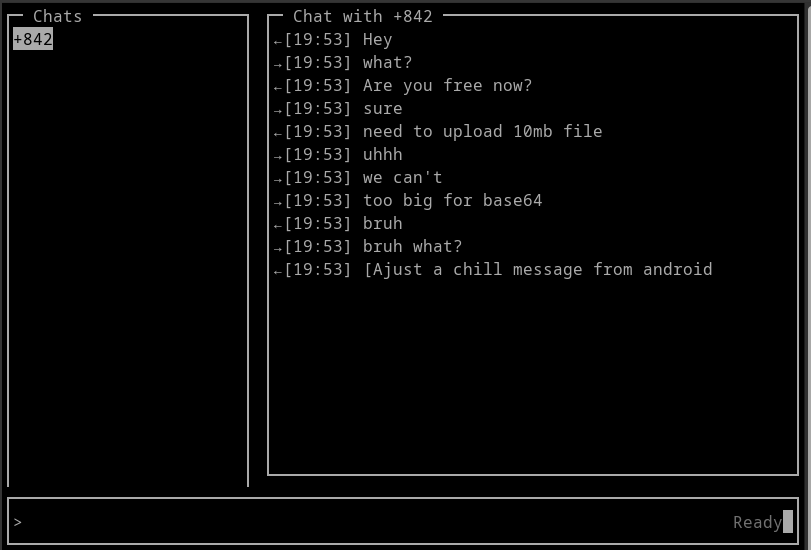

# 📞 Encrypted Chat & VoIP with PNG Database

This project is a **peer-to-peer chat and VoIP system** built with Python.  
It includes:

- **Encrypted JSON-over-PNG Database** (`pngdb.py`) – stores data securely in image files.
- **Async WebSocket Server** (`server.py`) – handles chat, file transfer, and VoIP signaling.
- **Terminal Client (TUI)** (`client.py`) – provides chat UI, file sharing, and VoIP with noise reduction.

---

## ✨ Features
- 🔐 **End-to-End Encryption** with Fernet (AES-256 under the hood).
- 🖼️ **[PNG Database](https://github.com/EndermanPC/pngdb)**: JSON-based data stored encrypted in PNG images.
- 💬 **Real-time Messaging**: Chat with contacts using Socket.IO over WebSockets.
- 📂 **File Sharing**: Send/receive encrypted files.
- 📞 **VoIP Calls**: Real-time audio calls with noise reduction and jitter buffering.
- 🖥️ **TUI Interface**: Chat, status, and call control in the terminal with `curses`.

---

## 🚀 Quick Start

### 1. Clone the repo
```bash
git clone https://github.com/EndermanPC/Chat-VoIP
cd Chat-VoIP
````

### 2. Install dependencies

```bash
pip install -r requirements.txt
```

### 3. Run the server

```bash
python server.py
```

Server defaults:

* WebSocket API: `http://localhost:5000`
* Database: `chat_db.png` (AES-encrypted)

### 4. Run the client

```bash
python client.py
```

You’ll be prompted for:

* Phone (`+84…`)
* Password

### 5. Use the TUI

* **Ctrl+N** → start new chat
* **Ctrl+F** → send file
* **Ctrl+O** → start/end call
* **Ctrl+K / Ctrl+L** → switch chats
* **Ctrl+C / Ctrl+D** → exit

---

## 🔧 Configuration

Set via environment variables:

| Variable            | Default                 | Description              |
| ------------------- | ----------------------- | ------------------------ |
| `CHAT_SERVER_URL`   | `http://localhost:5000` | Server address           |
| `CHAT_CLIENT_PHONE` | *prompted*              | Your phone number        |
| `CHAT_CLIENT_PASS`  | *prompted*              | Your password            |
| `CHAT_DOWNLOAD_DIR` | `.`                     | Directory to save files  |
| `CHAT_DB_FILE`      | `chat_db.png`           | PNG database file        |
| `CHAT_DB_PASSWORD`  | `change_me`             | Database password        |
| `VOIP_UDP_HOST`     | `127.0.0.1`             | Server IP for VoIP relay |
| `VOIP_UDP_PORT`     | `10000`                 | UDP port for VoIP relay  |

---

## 📸 Screenshots

Here’s how the TUI looks:

| Phone (Termux)                       | Desktop (Linux)                       |
| ------------------------------------ | ------------------------------------- |
|       |    |

*(Place your screenshots in `docs/screenshots/` folder, filenames can be changed as needed.)*

---

## 📦 Requirements

See [`requirements.txt`](./requirements.txt).
Major libraries:

* `python-socketio[aiohttp]` – WebSocket server & client
* `cryptography` – Fernet encryption
* `pycryptodome` – AES encryption for PNG DB
* `Pillow` – PNG image handling
* `sounddevice`, `numpy`, `noisereduce` – VoIP audio processing
* `bcrypt` – password hashing

---

## 🛠️ Project Structure

```
├── client.py   # Terminal chat & VoIP client
├── server.py   # Async chat/VoIP server
├── pngdb.py    # PNG-based encrypted DB
├── requirements.txt
├── README.md
└── screenshots
```

---

## 📌 Roadmap

* [ ] Group chats
* [ ] End-to-end encrypted calls
* [ ] Desktop client (GUI)

---

## 📝 License

Apache License 2.0 © 2025 Bùi Nguyễn Tấn Sang
